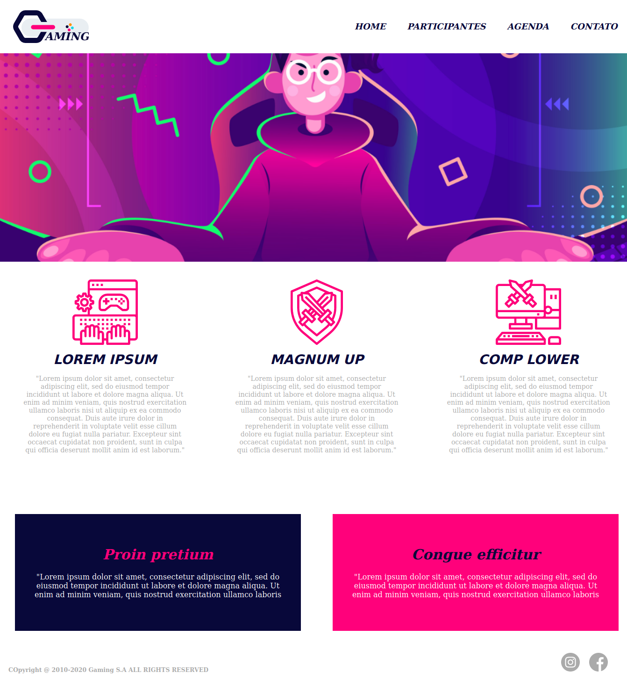
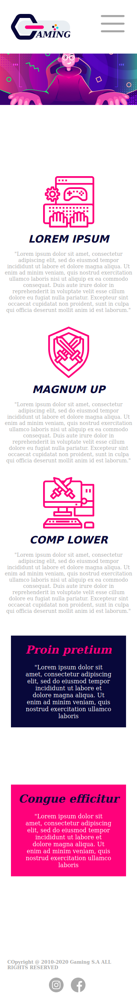

<h1 align="center">Bem vindo ao Gaming Page👋</h1>
<p>
  
  <a href="LICENSE" target="_blank">
    
  </a>
  <a href="https://twitter.com/andersonarorjdev" target="_blank">
    
  </a>
</p>

***

<p align="center">
  
</p>

<p align="center">
   
</p>

***
<h4>Esse foi um simples projeto desenvolvido, com o intuíto de prática. Pensado em um layout para página de E-Sports.🎮</h4>
 
> Com esse projeto eu pude treinar a relação de posicionamentos em css e ver quais deles se aplicam de forma melhor com o Styled-Components.🚀

#### Tecnologias Usadas:
- ReactJs (Lib performática e de grande escalabilidade, por sua componentização e grande quantia de documentação na Web).
- Styled-Components💅 (Lib usada para poder converter o CSS em Javascript, o que facilita a estilização dos componentes de forma individual e também ajuda na organização do código. Também pode ser percebido um  aumento de performance no carregamento do layout do que os arquivos em .CSS padrão.).
- Gerenciador de pacotes YARN🐈 (Optado por gosto pessoal).

Esses foram as techs usadas e os critérios para cada escolha.👨🏽‍💻🤷🏽‍♂️

*README.md desenvolvido em Portuguẽs para facilitar a leitura da documentação.*🙅🏼‍♂️
***

## Baixando o projeto para a sua máquina:🖥
```sh
  git clone https://github.com/andersonarorjdev/gaming-page.git
```


## Instalando as dependências para rodar o projeto:⬇

```sh
yarn 
```

## Iniciando o servidor para poder ver o projeto:👀(Irá abrir no seu navegador padrão, na porta 3000)

```sh
yarn start 
``` 

## Author

👤 **Andersonarorjdev**

* Website: https://andersonarorjdev.github.io
* Twitter: [@andersonarorjdev](https://twitter.com/andersonarorjdev)
* Github: [@andersonarorjdev](https://github.com/andersonarorjdev)
* LinkedIn: [@andersonarorjdev](https://linkedin.com/in/andersonarorjdev)

## Show your support

Give a ⭐️ if this project helped you!

## 📝 License

Copyright © 2020 [Andersonarorjdev](https://github.com/andersonarorjdev).<br />
This project is [MIT](LICENSE) licensed.

